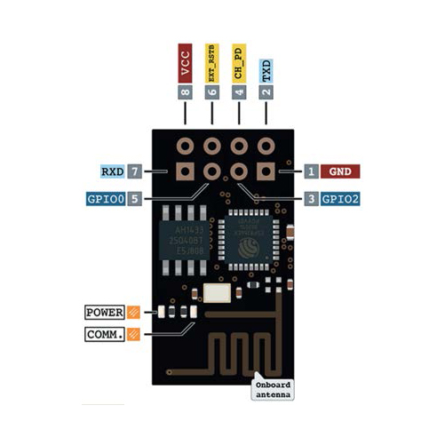
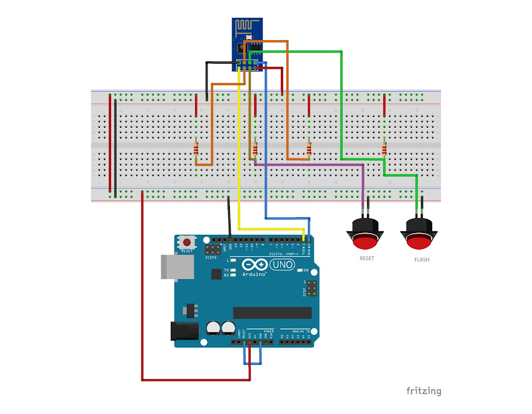
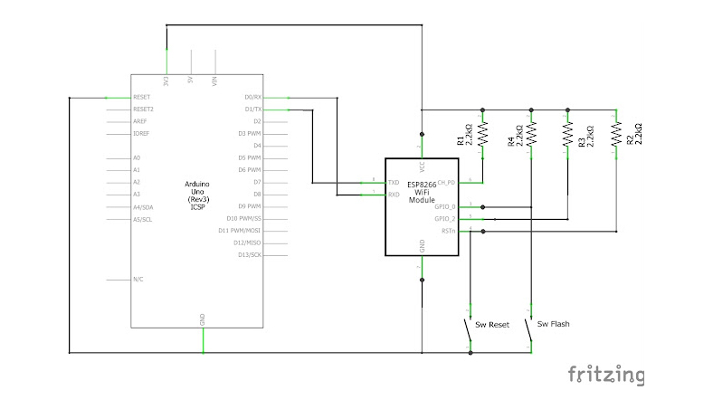

# Toggler Network

## 💡 Idea di partenza

L'idea è quella di usare una serie di moduli ESP8266-01S per realizzare una rete di dispositivi "smart", quali sensori, interruttori, pulsanti, e così via.

## 🧬 Struttura del progetto

Innanzitutto è necessario programmare il modulo ESP in modo che sia in grado di svolgere azioni particolari stabilite a priori. Ad esempio, si può scrivere uno script dedicato ad estrarre i dati da un sensore ed inviarli all'utente, a comandare un relè, o a gestire un servo motore. Si veda la cartella "<a href="script arduino">script arduino</a>".
  
La rete di sensori è gestita da un "controllore" centrale: una semplice paginetta web che invia richieste ai moduli ESP. Si veda "<a href="webapp">webapp</a>".

## ⚡ Il modulo ESP8266-01S

È un modulo WIFI programmabile mediante uno sketch Arduino (basato su C/C++) e capace di eseguirlo in autonomia.
  
Nel contesto di questo progetto, lo sketch eseguito non è che un web server di tipo REST che andrà ad eseguire azioni specifiche in base all'endpoint contattato. Questa parte di codice, infatti è uguale per tutte le tipologie di dispositivi "smart" che stiamo realizzando. Quello che cambia è l'azione specifica eseguita internamente in base, appunto, al compito che tale dispositivo deve svolgere. Una parte ostica nella fase di realizzazione del server REST è stata quella relativa alla gestione delle chiamate CORS. Una documentazione dettaglata riguardo la gestione e l'implementazione di un server di questo tipo è contenuta nella cartella "<a href="documentazione">documentazione</a>".
  
Dopo aver scritto correttamente lo sketch, è necessario caricarlo sulla scheda. Ci sono varie opzioni, tra cui l'utilizzo dell'<a href="https://www.az-delivery.de/products/esp8266-01s-mit-usb-adapter?ls=en">adattatore USB con ESP8266-01S</a>. Avendo a disposizione una scheda Arduino UNO, è necessario costruire un piccolo circuito:

Come e' possibile notare dallo schema elettrico sono presenti due pulsanti collegati nel seguente modo:
- __SW Reset__: sul pin RST di ESP8266
- __SW Flash__: sul pin GPIO0 di ESP8266

Questo e' necessario in quanto per poter programmare correttamente lo ESP8266-01 è necessario portarlo nello stato UART Bootloader. Questo si ottiene con la seguente procedura:

- si mantiene premuto il pulsante SW Flash
- si preme e si rilascia il pulsante SW Reset
- si rilascia il pulsante SW Flash

Si suggerisce di effettuare tale procedura solo alcuni secondi prima dell'inizio del caricamento dello sketch dal PC allo ESP8266-01.

